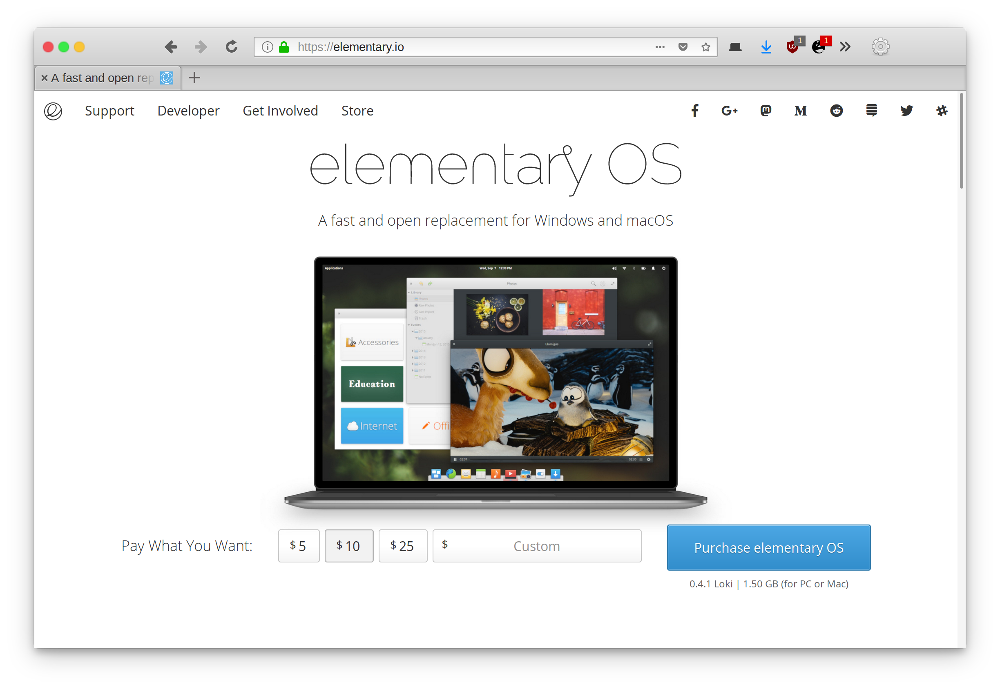

# An elementary Theme for Firefox Quantum

## Forked to support OS X-style window controls

This userChrome.css mimics the [elementary GTK+ theme](https://github.com/elementary/stylesheet) to make firefox blend in better in elementary OS.

I don't understand Firefox styling well enough to be able to support both window control styles, which is why this hasn't been merged back up stream. Install the two versions as separate themes.

## How to use
1. Go to [about:support](about:support) in Firefox
2. Application Basics > Profile Directory > Open Directory
3. Create a folder named `chrome`
4. Paste userChrome.css in this folder
